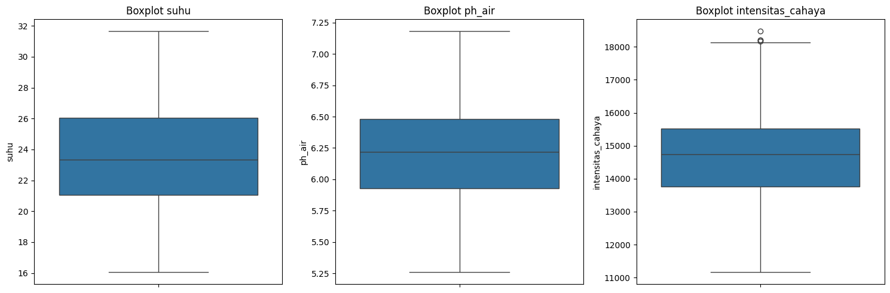

# Laporan Proyek Machine Learning - Fina Dwi Aulia

## Domain Proyek: Pertanian

### Latar Belakang

Hidroponik merupakan metode budidaya tanaman tanpa menggunakan tanah, melainkan dengan media air dan nutrisi. Metode ini semakin populer di lingkungan perkotaan karena efisiensi ruang dan kemudahan kontrol terhadap faktor pertumbuhan tanaman seperti suhu, pH air, dan intensitas cahaya. Namun, petani hidroponik pemula sering mengalami kesulitan dalam memilih jenis tanaman yang tepat untuk kondisi lingkungan tertentu. Kesalahan dalam memilih tanaman bisa menyebabkan pertumbuhan suboptimal atau bahkan kegagalan panen.

Dengan menerapkan machine learning, kita dapat mengembangkan sistem klasifikasi yang mampu merekomendasikan jenis tanaman hidroponik berdasarkan parameter lingkungan. Pendekatan ini akan membantu para petani atau penghobi hidroponik untuk mengambil keputusan yang lebih akurat dan berbasis data.

Menurut penelitian, penerapan kecerdasan buatan dalam pertanian presisi terbukti mampu meningkatkan hasil panen hingga 20% serta mengurangi kerugian akibat kesalahan manusia [1]. Oleh karena itu, pengembangan sistem klasifikasi tanaman hidroponik berbasis data lingkungan menjadi sangat relevan untuk mendukung praktik pertanian modern yang efisien dan berkelanjutan.
> Referensi:
> [1] A. Jain, "How AI is Used in Farming?", DigitalDefynd, 2023. [Online]. Tersedia: https://digitaldefynd.com/IQ/ai-use-in-farming/. [Diakses: 12 Mei 2025].

## Business Understanding
### Problem Statements
1. Bagaimana cara menentukan jenis tanaman hidroponik yang cocok berdasarkan data lingkungan seperti suhu, pH air, dan intensitas cahaya?
2. Bagaimana akurasi model machine learning dalam mengklasifikasikan jenis tanaman berdasarkan parameter-parameter tersebut?

### Goals
1. Membangun model klasifikasi machine learning yang dapat memprediksi jenis tanaman hidroponik berdasarkan fitur lingkungan.
2. Mengevaluasi kinerja model dengan metrik klasifikasi seperti akurasi, precision, recall, dan F1-score.

### Solution Statements
1. Mengembangkan model klasifikasi menggunakan beberapa algoritma seperti Decision Tree dan Random Forest.
2. Melakukan hyperparameter tuning untuk meningkatkan akurasi model terbaik.
3. Menggunakan metrik evaluasi klasifikasi untuk membandingkan performa antar model.

## Data Understanding
### Sumber Data
Dataset ini merupakan data sintetis yang dibuat berdasarkan informasi dari jurnal dan artikel terkait hidroponik karena belum tersedia dataset publik yang sesuai. Dataset ini dikembangkan dengan bantuan model AI berdasarkan kisaran nilai realistis.

| No | Kolom              | Jumlah Non-Null | Tipe Data | Deskripsi                                   |
|----|--------------------|------------------|-----------|---------------------------------------------|
| 1  | suhu               | 500              | float64   | Suhu lingkungan (dalam derajat Celsius)     |
| 2  | ph_air             | 500              | float64   | pH larutan nutrisi hidroponik               |
| 3  | intensitas_cahaya  | 500              | int64     | Intensitas cahaya (dalam satuan lux)        |
| 4  | jenis_tanaman      | 500              | object    | Jenis tanaman hidroponik (target klasifikasi) |

Dataset ini terdiri dari 500 baris dan 4 kolom, yang mencakup tiga fitur numerik (suhu, pH air, dan intensitas cahaya), serta satu fitur target berupa jenis_tanaman.
### Statistik Deskriptif Fitur Numerik

| Statistik | Suhu (°C) | pH Air | Intensitas Cahaya (lux) |
|-----------|-----------|--------|--------------------------|
| Count     | 500       | 500    | 500                      |
| Mean      | 23.49     | 6.22   | 14,664.29                |
| Std       | 3.33      | 0.38   | 1,384.33                 |
| Min       | 16.06     | 5.26   | 11,167                   |
| 25%       | 21.07     | 5.93   | 13,759.25                |
| 50%       | 23.32     | 6.22   | 14,738.50                |
| 75%       | 26.04     | 6.48   | 15,512.75                |
| Max       | 31.64     | 7.18   | 18,469                   |

Dilihat dari statistik deskriptif dan asumsi distribusi normal:

- Suhu berkisar antara 16.06°C hingga 31.64°C dengan rata-rata 23.49°C.
- Nilai pH berada dalam rentang 5.26 – 7.18, yang masih dalam kisaran umum pH larutan hidroponik (idealnya 5.5 – 6.5).
- Rentang intensitas Cahaya dari 11.167 lux hingga 18.469 lux.

### Link Dataset
[Dataset](https://docs.google.com/spreadsheets/d/1AUqeKAaF4xarwE3Zbh5aum3srejIIV5nz_2SEJ8Y0JI/edit?gid=1887223174#gid=1887223174)

- Distribusi nilai suhu berkisar antara 15 - 30 derajat Celsius
- Nilai pH air dominan berada di antara 5.5 - 7.0
- Intensitas cahaya bervariasi dari 12.000 - 18.000 Lux
- Jenis tanaman hidroponik yang digunakan seperti selada, kangkung, bayam, sawi, dan pakcoy

- Masing-masing kelas memiliki jumlah data yang sama, yaitu 100 data poin per kelas.
- Distribusi seimbang (balanced dataset) sangat ideal untuk model klasifikasi

| Kolom              | Jumlah Missing Value |
|--------------------|----------------------|
| suhu               | 0                    |
| ph_air             | 0                    |
| intensitas_cahaya  | 0                    |
| jenis_tanaman      | 0                    |

**Jumlah data duplikat:** 0
- Tidak terdapat missing value (data kosong) di semua kolom.
- Tidak ditemukan duplikat data.

### outlier

- Data suhu dan ph_air berada dalam batas normal secara statistik. Tidak ada outlier yang perlu ditangani.
- Pada bagian intensitas Cahaya ditemukan beberapa nilai ekstrem (>18.144 lux).
- Maka kita akan menghapus baris yang mengandung outlier pada intensitas_cahaya dari dataset.

## Data Preparation
Pada tahap Data Preparation, dilakukan serangkaian proses untuk menyiapkan data sebelum digunakan dalam pelatihan model. Tahapan ini sangat penting untuk memastikan data dalam kondisi optimal agar model machine learning dapat belajar secara efektif dan menghasilkan prediksi yang akurat. Adapun langkah-langkah yang dilakukan dalam urutan sebagai berikut:
- Pemilahan Fitur dan Label:
  - Fitur yang digunakan adalah suhu, ph_air, dan intensitas_cahaya, sedangkan label target adalah jenis_tanaman.
Pemisahan ini diperlukan agar algoritma hanya mempelajari pola dari fitur dan memprediksi label.
- Encoding Label (Label Encoding):
  - Kolom jenis_tanaman yang berupa kategori (string) diubah menjadi format numerik menggunakan LabelEncoder.
- Normalisasi Fitur (Standardization):
  - Dilakukan standardisasi pada fitur numerik menggunakan StandardScaler agar memiliki distribusi dengan rata-rata 0 dan standar deviasi 1.
- Split Data (Train-Test Split):
  - Data dibagi menjadi 80% untuk pelatihan (X_train, y_train) dan 20% untuk pengujian (X_test, y_test) menggunakan train_test_split.
Proses ini memastikan model dapat diuji pada data yang belum pernah dilihat untuk mengevaluasi kemampuannya secara adil.

## Modeling

Pada tahap Modeling, dua algoritma machine learning digunakan untuk menyelesaikan permasalahan klasifikasi jenis tanaman hidroponik berdasarkan parameter lingkungan: Decision Tree Classifier dan Random Forest Classifier. Tujuan dari tahap ini adalah membangun model yang mampu mempelajari hubungan antara fitur (suhu, ph_air, intensitas_cahaya) dan label (jenis_tanaman), kemudian mengevaluasi kinerjanya menggunakan data uji.
1. Decision Tree Classifier
- Parameter utama:
  - max_depth=5: Membatasi kedalaman maksimum pohon keputusan untuk menghindari overfitting.
  - random_state=42: Agar hasil pelatihan konsisten dan dapat direproduksi.
- Kelebihan:
  - Mudah diinterpretasikan dan divisualisasikan.
  - Cepat dalam proses pelatihan dan prediksi.
- Kekurangan:
  - Rentan terhadap overfitting jika tidak dikontrol dengan baik.
  - Sensitif terhadap variasi data — pohon bisa sangat berubah hanya karena sedikit perubahan data.
2. Random Forest Classifier
- Parameter utama:
  - n_estimators=100: Menggunakan 100 pohon keputusan dalam ensemble.
  - max_depth=10: Membatasi kedalaman pohon untuk mencegah overfitting.
  - random_state=42: Menjamin reproducibility.
- Kelebihan:
  - Lebih stabil dan akurat dibandingkan Decision Tree tunggal karena menggunakan pendekatan ensemble.
  - Mengurangi overfitting dengan menggabungkan prediksi dari banyak pohon.
- Kekurangan:
  - Kurang interpretatif (seperti black box).
  - Waktu pelatihan dan prediksi sedikit lebih lama dibanding Decision Tree.
- Pemilihan Model Terbaik
  - Setelah dilakukan evaluasi pada kedua model menggunakan metrik seperti akurasi, precision, recall, dan F1-score, Random Forest Classifier dipilih sebagai model terbaik dengan akurasi sebesar 56%, lebih tinggi dibanding Decision Tree yang hanya mencapai 46%. Selain itu, Random Forest juga menunjukkan performa yang lebih stabil antar kelas berdasarkan confusion matrix dan classification report.
- Alasan Pemilihan:
  - Random Forest menunjukkan generalisasi yang lebih baik.
  - Meskipun belum dilakukan hyperparameter tuning, hasil awalnya lebih menjanjikan dibanding Decision Tree.
  - Distribusi performa antar kelas lebih seimbang, sehingga lebih andal untuk digunakan dalam aplikasi nyata.
Jika ingin meningkatkan akurasi lebih lanjut, direkomendasikan untuk melakukan hyperparameter tuning (misalnya menggunakan GridSearchCV atau RandomizedSearchCV) dan mempertimbangkan model alternatif seperti K-Nearest Neighbors, SVM, atau Gradient Boosting.

## Evaluation

Pada tahap evaluasi, digunakan beberapa metrik evaluasi untuk mengukur kinerja model dalam menyelesaikan permasalahan klasifikasi multikelas jenis tanaman hidroponik. Evaluasi ini dilakukan pada dua model yang telah dibangun sebelumnya: Decision Tree Classifier dan Random Forest Classifier.

Metrik Evaluasi yang Digunakan
- Accuracy
- Precision
- Recall
- F1-Score
- Confusion Matrix
Metrik-metrik ini dipilih karena sangat sesuai untuk kasus klasifikasi multikelas yang balanced (jumlah data antar kelas seimbang). Tidak digunakan metrik seperti ROC-AUC karena kurang relevan untuk klasifikasi multikelas tanpa konversi menjadi binary.
Penjelasan Metrik Evaluasi
- Accuracy:
  - Proporsi prediksi yang benar dari total jumlah data.Cocok untuk dataset dengan distribusi kelas yang seimbang, seperti pada proyek ini.
- Precision:
  - Rasio antara jumlah prediksi benar positif dengan total prediksi positif. Menunjukkan seberapa “tepat” model saat memprediksi kelas tertentu.
- Recall (Sensitivity):
  - Rasio antara jumlah prediksi benar positif dengan total jumlah aktual positif.Menunjukkan kemampuan model dalam menangkap semua instance dari suatu kelas.
- F1-Score:
  - Rata-rata harmonis dari precision dan recall. Digunakan untuk menyeimbangkan precision dan recall, khususnya saat keduanya penting.
- Confusion Matrix:
  - Matriks yang menunjukkan jumlah prediksi benar dan salah untuk setiap kelas. Membantu mengevaluasi performa antar kelas secara visual.
Hasil Evaluasi Model
- Decision Tree Classifier
  - Accuracy: 46%
  - F1-score tiap kelas bervariasi; kelas 0 memiliki recall tinggi (0.80) tetapi precision rendah.
  - Model cenderung overfit ke beberapa kelas dan underfit ke lainnya.
- Random Forest Classifier
  - Accuracy: 56%
  - Precision, recall, dan F1-score lebih stabil antar kelas dibanding Decision Tree.
  - Confusion matrix menunjukkan bahwa Random Forest lebih baik dalam mengklasifikasikan kelas 1 dan 2, walaupun kelas 4 masih sering salah klasifikasi.

### Hasil Evaluasi

| Model           | Akurasi | Macro Avg F1 | Catatan Singkat                    |
|----------------|---------|---------------|------------------------------------|
| Decision Tree  | 46%     | 49%           | Overfit, kurang generalisasi       |
| Random Forest  | 56%     | 58%           | Sedikit lebih baik, tapi masih underperform |

## Kesimpulan

Evaluasi menunjukkan bahwa Random Forest Classifier lebih unggul dibandingkan Decision Tree dalam menyelesaikan masalah klasifikasi multikelas ini. Metrik evaluasi yang digunakan memberikan gambaran menyeluruh tentang kinerja model dari sisi ketepatan, kelengkapan, dan keseimbangan performa antar kelas. Meskipun hasilnya belum optimal, evaluasi ini menjadi dasar penting untuk proses peningkatan model selanjutnya, seperti melalui tuning hyperparameter atau eksplorasi model lain.
