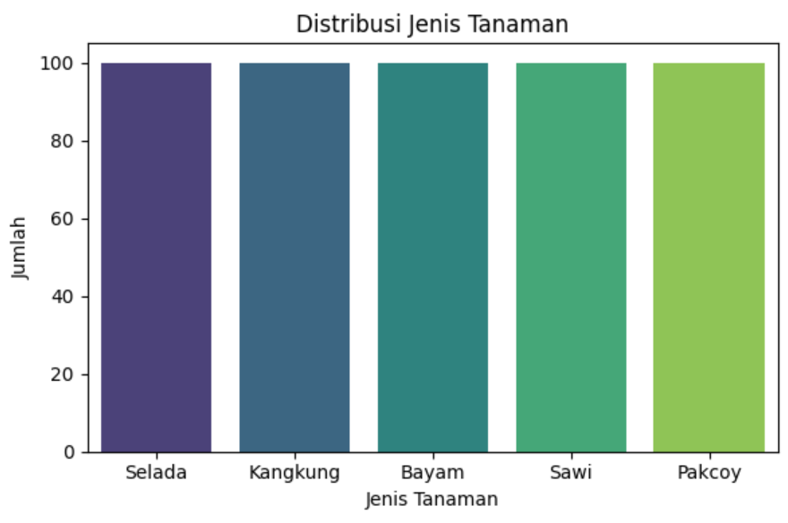

# Laporan Proyek Machine Learning - Fina Dwi Aulia

## Domain Proyek: Pertanian

### Latar Belakang

Hidroponik merupakan metode budidaya tanaman tanpa menggunakan tanah, melainkan dengan media air dan nutrisi. Metode ini semakin populer di lingkungan perkotaan karena efisiensi ruang dan kemudahan kontrol terhadap faktor pertumbuhan tanaman seperti suhu, pH air, dan intensitas cahaya. Namun, petani hidroponik pemula sering mengalami kesulitan dalam memilih jenis tanaman yang tepat untuk kondisi lingkungan tertentu. Kesalahan dalam memilih tanaman bisa menyebabkan pertumbuhan suboptimal atau bahkan kegagalan panen.

Dengan menerapkan machine learning, kita dapat mengembangkan sistem klasifikasi yang mampu merekomendasikan jenis tanaman hidroponik berdasarkan parameter lingkungan. Pendekatan ini akan membantu para petani atau penghobi hidroponik untuk mengambil keputusan yang lebih akurat dan berbasis data.

Menurut penelitian, penerapan kecerdasan buatan dalam pertanian presisi terbukti mampu meningkatkan hasil panen hingga 20% serta mengurangi kerugian akibat kesalahan manusia [1]. Oleh karena itu, pengembangan sistem klasifikasi tanaman hidroponik berbasis data lingkungan menjadi sangat relevan untuk mendukung praktik pertanian modern yang efisien dan berkelanjutan.
> Referensi:
> [1] A. Jain, "How AI is Used in Farming?", DigitalDefynd, 2023. [Online]. Tersedia: https://digitaldefynd.com/IQ/ai-use-in-farming/. [Diakses: 12 Mei 2025].

## Business Understanding
### Problem Statements
1. Bagaimana cara menentukan jenis tanaman hidroponik yang cocok berdasarkan data lingkungan seperti suhu, pH air, dan intensitas cahaya?
2. Bagaimana akurasi model machine learning dalam mengklasifikasikan jenis tanaman berdasarkan parameter-parameter tersebut?

### Goals
1. Membangun model klasifikasi machine learning yang dapat memprediksi jenis tanaman hidroponik berdasarkan fitur lingkungan.
2. Mengevaluasi kinerja model dengan metrik klasifikasi seperti akurasi, precision, recall, dan F1-score.

### Solution Statements
1. Mengembangkan model klasifikasi menggunakan beberapa algoritma seperti Decision Tree dan Random Forest.
2. Melakukan hyperparameter tuning untuk meningkatkan akurasi model terbaik.
3. Menggunakan metrik evaluasi klasifikasi untuk membandingkan performa antar model.

## Data Understanding
### Sumber Data
Dataset ini merupakan data sintetis yang dibuat berdasarkan informasi dari jurnal dan artikel terkait hidroponik karena belum tersedia dataset publik yang sesuai. Dataset ini dikembangkan dengan bantuan model AI berdasarkan kisaran nilai realistis.

| No | Kolom              | Jumlah Non-Null | Tipe Data | Deskripsi                                   |
|----|--------------------|------------------|-----------|---------------------------------------------|
| 1  | suhu               | 500              | float64   | Suhu lingkungan (dalam derajat Celsius)     |
| 2  | ph_air             | 500              | float64   | pH larutan nutrisi hidroponik               |
| 3  | intensitas_cahaya  | 500              | int64     | Intensitas cahaya (dalam satuan lux)        |
| 4  | jenis_tanaman      | 500              | object    | Jenis tanaman hidroponik (target klasifikasi) |

Dataset ini terdiri dari 500 baris dan 4 kolom, yang mencakup tiga fitur numerik (suhu, pH air, dan intensitas cahaya), serta satu fitur target berupa jenis_tanaman.
### Statistik Deskriptif Fitur Numerik

| Statistik | Suhu (°C) | pH Air | Intensitas Cahaya (lux) |
|-----------|-----------|--------|--------------------------|
| Count     | 500       | 500    | 500                      |
| Mean      | 23.49     | 6.22   | 14,664.29                |
| Std       | 3.33      | 0.38   | 1,384.33                 |
| Min       | 16.06     | 5.26   | 11,167                   |
| 25%       | 21.07     | 5.93   | 13,759.25                |
| 50%       | 23.32     | 6.22   | 14,738.50                |
| 75%       | 26.04     | 6.48   | 15,512.75                |
| Max       | 31.64     | 7.18   | 18,469                   |

Dilihat dari statistik deskriptif dan asumsi distribusi normal:

- Suhu berkisar antara 16.06°C hingga 31.64°C dengan rata-rata 23.49°C.
- Nilai pH berada dalam rentang 5.26 – 7.18, yang masih dalam kisaran umum pH larutan hidroponik (idealnya 5.5 – 6.5).
- Rentang intensitas Cahaya dari 11.167 lux hingga 18.469 lux.

### Link Dataset
[Dataset](https://docs.google.com/spreadsheets/d/1AUqeKAaF4xarwE3Zbh5aum3srejIIV5nz_2SEJ8Y0JI/edit?gid=1887223174#gid=1887223174)

- Distribusi nilai suhu berkisar antara 15 - 30 derajat Celsius
- Nilai pH air dominan berada di antara 5.5 - 7.0
- Intensitas cahaya bervariasi dari 12.000 - 18.000 Lux
- Jenis tanaman hidroponik yang digunakan seperti selada, kangkung, bayam, sawi, dan pakcoy

- Masing-masing kelas memiliki jumlah data yang sama, yaitu 100 data poin per kelas.
- Distribusi seimbang (balanced dataset) sangat ideal untuk model klasifikasi

| Kolom              | Jumlah Missing Value |
|--------------------|----------------------|
| suhu               | 0                    |
| ph_air             | 0                    |
| intensitas_cahaya  | 0                    |
| jenis_tanaman      | 0                    |

**Jumlah data duplikat:** 0
- Tidak terdapat missing value (data kosong) di semua kolom.
- Tidak ditemukan duplikat data.

### outlier

## Data Preparation
* Normalisasi fitur menggunakan StandardScaler
* Encode label target menggunakan LabelEncoder
* Split data menjadi train dan test (80:20)

## Modeling

### Algoritma yang Digunakan

1. Decision Tree Classifier
2. Random Forest Classifier

### Parameter dan Proses

* Decision Tree: menggunakan max\_depth sebagai parameter tuning
* Random Forest: tuning parameter n\_estimators dan max\_depth

### Kelebihan dan Kekurangan

* Decision Tree: mudah diinterpretasi, rawan overfitting
* Random Forest: akurasi lebih tinggi, lebih kompleks dan lambat dibanding Decision Tree

### Model Terbaik

Random Forest dipilih sebagai model terbaik karena memiliki akurasi dan F1-score tertinggi setelah tuning.

## Evaluation

### Metrik Evaluasi

* Accuracy
* Precision
* Recall
* F1-Score

### Penjelasan Metrik

F1-score memberikan keseimbangan antara precision dan recall, cocok untuk kasus klasifikasi multikelas.

### Hasil Evaluasi

| Model           | Akurasi | Macro Avg F1 | Catatan Singkat                    |
|----------------|---------|---------------|------------------------------------|
| Decision Tree  | 46%     | 49%           | Overfit, kurang generalisasi       |
| Random Forest  | 56%     | 58%           | Sedikit lebih baik, tapi masih underperform |

## Kesimpulan

Model klasifikasi yang dibangun dapat memprediksi jenis tanaman hidroponik dengan performa yang cukup baik. Random Forest menjadi model terbaik dan dapat digunakan sebagai dasar rekomendasi dalam sistem penanaman hidroponik otomatis di masa depan.
